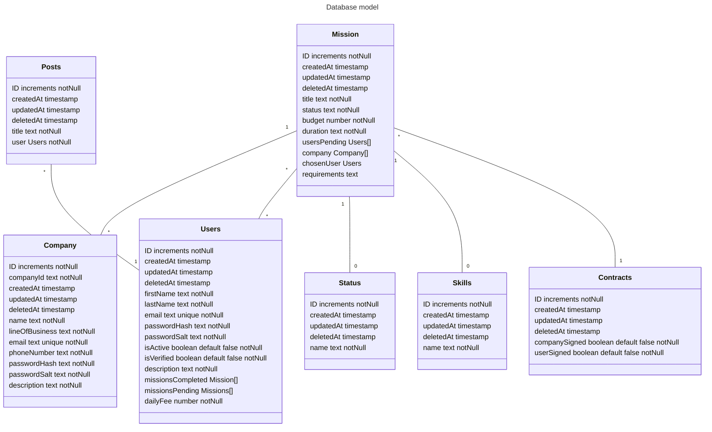

```mermaid
---
title: Database model
---

classDiagram

Mission "1"--"*" Company
Mission "*"--"*" Users
Mission "1"-- "0"Status
Mission "1"-- "0"Skills
Posts "*"-- "1"Users
Mission "*"-- "1"Contracts

class Users {
    ID increments notNull
    createdAt timestamp
    updatedAt timestamp
    deletedAt timestamp
    firstName text notNull
    lastName text notNull
    email text unique notNull
    passwordHash text notNull
    passwordSalt text notNull
    isActive boolean default false notNull
    isVerified boolean default false notNull
    description text notNull
    missionsCompleted Mission[]
    missionsPending Missions[]
    dailyFee number notNull
}

class Status {
    ID increments notNull
    createdAt timestamp
    updatedAt timestamp
    deletedAt timestamp
    name text notNull
}

class Company {
    ID increments notNull
    companyId text notNull
    createdAt timestamp
    updatedAt timestamp
    deletedAt timestamp
    name text notNull
    lineOfBusiness text notNull
    email text unique notNull
    phoneNumber text notNull
    passwordHash text notNull
    passwordSalt text notNull
    description text notNull
}

class Mission {
    ID increments notNull
    createdAt timestamp
    updatedAt timestamp
    deletedAt timestamp
    title text notNull
    status text notNull
    budget number notNull
    duration text notNull
    usersPending Users[]
    company Company[]
    chosenUser Users
    requirements text
}

class Posts {
    ID increments notNull
    createdAt timestamp
    updatedAt timestamp
    deletedAt timestamp
    title text notNull
    user Users notNull
}

class Skills {
    ID increments notNull
    createdAt timestamp
    updatedAt timestamp
    deletedAt timestamp
    name text notNull
}

class Contracts {
    ID increments notNull
    createdAt timestamp
    updatedAt timestamp
    deletedAt timestamp
    companySigned boolean default false notNull
    userSigned boolean default false notNull
}
```
