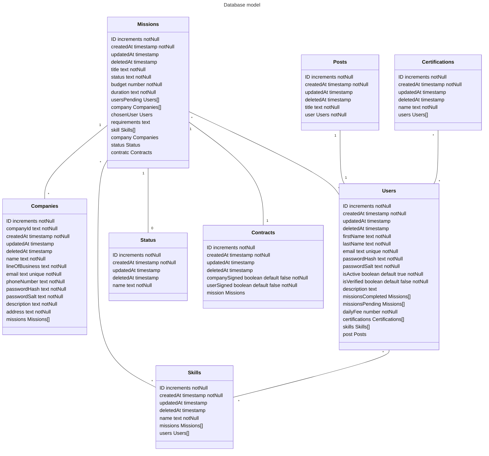

```mermaid
---
title: Database model
---
classDiagram

Missions "1"--"*" Companies
Missions "*"--"*" Users
Missions "1"-- "0"Status
Missions "*"-- "*"Skills
Posts "1"-- "1"Users
Missions "1"-- "1"Contracts
Certifications "*"-- "*"Users
Users "*"-- "*"Skills

class Users {
    ID increments notNull
    createdAt timestamp notNull
    updatedAt timestamp
    deletedAt timestamp
    firstName text notNull
    lastName text notNull
    email text unique notNull
    passwordHash text notNull
    passwordSalt text notNull
    isActive boolean default true notNull
    isVerified boolean default false notNull
    description text
    missionsCompleted Missions[]
    missionsPending Missions[]
    dailyFee number notNull
    certifications Certifications[]
    skills Skills[]
    post Posts
}

class Status {
    ID increments notNull
    createdAt timestamp notNull
    updatedAt timestamp
    deletedAt timestamp
    name text notNull
}

class Companies {
    ID increments notNull
    companyId text notNull
    createdAt timestamp notNull
    updatedAt timestamp
    deletedAt timestamp
    name text notNull
    lineOfBusiness text notNull
    email text unique notNull
    phoneNumber text notNull
    passwordHash text notNull
    passwordSalt text notNull
    description text notNull
    address text notNull
    missions Missions[]
}

class Missions {
    ID increments notNull
    createdAt timestamp notNull
    updatedAt timestamp
    deletedAt timestamp
    title text notNull
    status text notNull
    budget number notNull
    duration text notNull
    usersPending Users[]
    company Companies[]
    chosenUser Users
    requirements text
    skill Skills[]
    company Companies
    status Status
    contratc Contracts
}

class Posts {
    ID increments notNull
    createdAt timestamp notNull
    updatedAt timestamp
    deletedAt timestamp
    title text notNull
    user Users notNull
}

class Skills {
    ID increments notNull
    createdAt timestamp notNull
    updatedAt timestamp
    deletedAt timestamp
    name text notNull
    missions Missions[]
    users Users[]
}

class Contracts {
    ID increments notNull
    createdAt timestamp notNull
    updatedAt timestamp
    deletedAt timestamp
    companySigned boolean default false notNull
    userSigned boolean default false notNull
    mission Missions
}

class Certifications {
    ID increments notNull
    createdAt timestamp notNull
    updatedAt timestamp
    deletedAt timestamp
    name text notNull
    users Users[]
}
```
